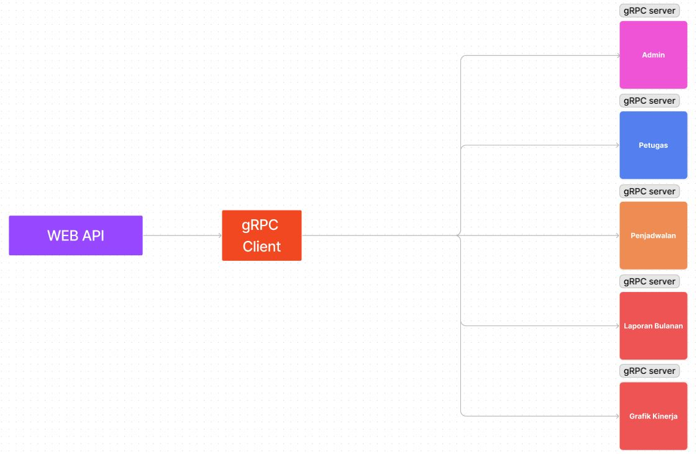

# UAS Pemrograman WEB Lanjut 2023 Backend

Repositori ini berisi kode program untuk program UAS Pemrograman WEB Lanjut 2023 Backend. Program ini dibangun dengan menggunakan bahasa pemrograman [Python](https://www.python.org/) dan framework [Pyramid](https://trypyramid.com/). Selain itu terdapat beberapa library yang digunakan untuk pengelolaan data dalam sistem seperti [SQLAlchemy](https://www.sqlalchemy.org/) dan [Alembic](https://alembic.sqlalchemy.org/en/latest/).

# Arsitektur Sistem

Arsitktur yang digunakan dalam sistem ini adalah arsitektur GRPC (Google Remote Procedure Call) untuk pengelolaan servis dalam sistem seperti penjadwalan, admin, petugas, laporan bulanan, dan lainnya.

# Instalasi

Coming soon!

# Author

Hendri Aldi Zulfan

- [Github](github.com/henhen02)
- [hendrialdizulfan@gmail.com](mailto:hendrialdizulfan@gmail.com)
